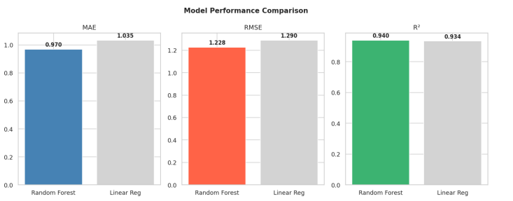
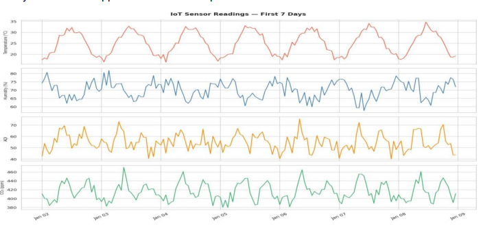
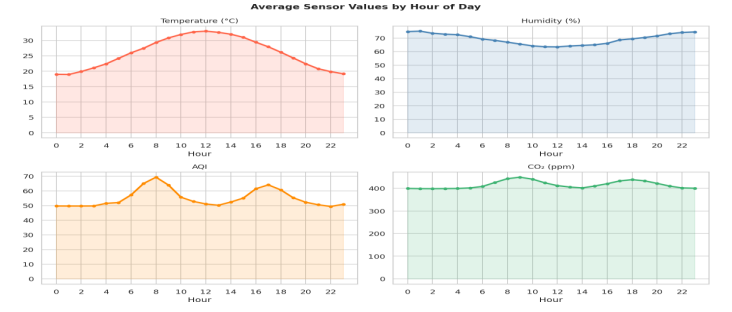
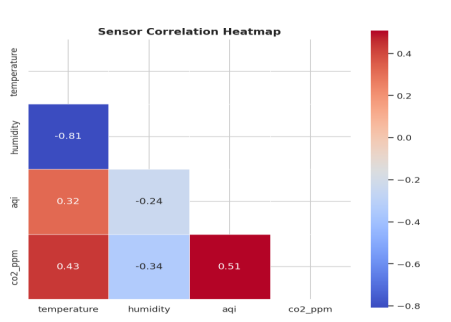
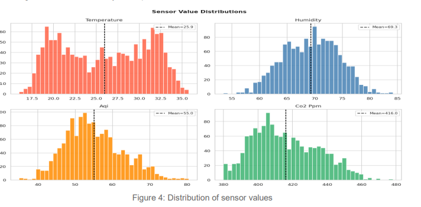
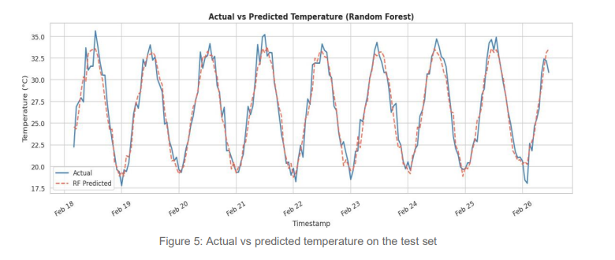
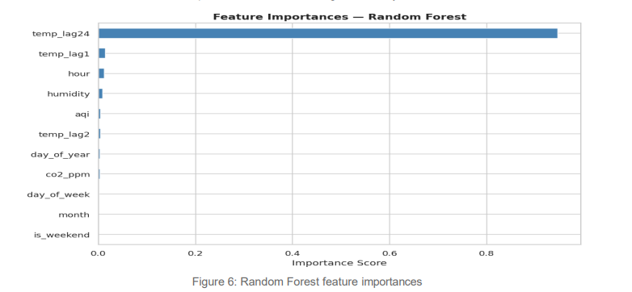
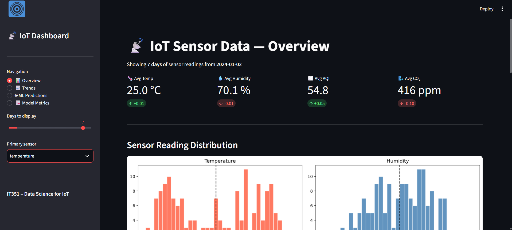

# 📡 IoT Sensor Data Prediction Dashboard

A machine learning system that analyzes IoT sensor data and predicts temperature using Random Forest regression, presented through an interactive Streamlit dashboard.


---

## 🎯 Overview

IoT devices in smart homes, factories, and environmental monitoring systems generate large volumes of sensor data that need to be cleaned, analyzed, and turned into actionable predictions. This project builds a complete pipeline — from raw synthetic sensor data to a deployed prediction dashboard — covering:

- Data preprocessing and outlier handling
- Exploratory data analysis (EDA)
- Time-series feature engineering
- Random Forest regression for temperature prediction
- An interactive 4-page Streamlit dashboard

---

## 📊 Results

| Metric | Random Forest | Linear Regression |
|--------|:---:|:---:|
| MAE (°C) | **0.9699** | 1.0345 |
| RMSE (°C) | **1.2275** | 1.2904 |
| R² Score | **0.9402** | 0.9339 |

Random Forest explains **~94% of the variance** in temperature, with an average error of under 1°C on hourly predictions.



---

## 🗂️ Dataset

Since no free public dataset contained all four required sensors, a **synthetic IoT dataset** was generated to simulate realistic conditions:

| Sensor | Unit | Behavior | Range |
|--------|------|----------|-------|
| Temperature | °C | Daily sinusoidal cycle, peaks ~2 PM | 18 – 37 |
| Humidity | % | Inversely related to temperature | 20 – 100 |
| AQI | – | Peaks during morning/evening rush hours | 0 – 200 |
| CO₂ | ppm | Higher during peak activity hours | 380 – 700 |

- **60 days** of hourly readings → **1,440 data points per sensor**
- **3% random missing values** injected per sensor to simulate real sensor dropout

---

## 🧹 Data Preprocessing

- **Missing values:** Forward-fill (`ffill`), since the previous hourly reading is usually close to the missing one; back-fill (`bfill`) used for any gaps at the start of the series.
- **Outliers:** IQR method — values outside `Q1 - 1.5×IQR` and `Q3 + 1.5×IQR` were clipped rather than removed, to preserve data volume.
- **Feature engineering:** Extracted `hour`, `day_of_week`, `day_of_year`, `month`, and `is_weekend` from timestamps, plus **lag features** (`temp_lag1`, `temp_lag2`, `temp_lag24`) — the model's single strongest predictors, since temperature does not change abruptly hour to hour.

---

## 🔍 Exploratory Data Analysis

**Sensor readings over the first 7 days** — the daily temperature cycle is clearly visible, with humidity moving inversely as expected.



**Average sensor values by hour of day** — rush-hour peaks in AQI and CO₂ around 8 AM and 5 PM.



**Correlation heatmap** — temperature and humidity show a strong negative correlation; AQI and CO₂ are positively correlated, both driven by traffic/activity levels.



**Distribution of sensor values** — temperature and humidity are roughly normally distributed; AQI and CO₂ are right-skewed due to activity-hour peaks.



---

## 🤖 Machine Learning Model

- **Train/test split:** Chronological 80/20 split (not random) — a random split would leak future information into training, which is invalid for time-series data.
  - Training: 1,152 samples · Test: 288 samples
- **Random Forest Regressor** (`n_estimators=150`, `max_depth=12`) — chosen as the main model for its ability to capture non-linear patterns.
- **Linear Regression** — used as a baseline for comparison.

**Actual vs. predicted temperature on the test set:**



**Feature importance** — lag features (`temp_lag24`, `temp_lag1`) dominate, confirming that recent and same-time-yesterday readings are the most powerful predictors.



---

## 🖥️ Dashboard

Built with **Streamlit**, the dashboard has 4 pages navigable from the sidebar, plus a day-range slider and a sensor selector.

| Page | Content |
|------|---------|
| 📊 Overview | KPI metric cards, sensor distributions, correlation heatmap |
| 📈 Trends | Time-series and hourly average charts for the selected sensor |
| 🤖 ML Predictions | Actual vs. predicted chart, feature importance, residual analysis |
| 📉 Model Metrics | MAE / RMSE / R² comparison table and bar charts |



---

## 🛠️ Tech Stack

`Python` · `pandas` · `NumPy` · `scikit-learn` · `Streamlit` · `Matplotlib` · `Seaborn`

---

## 🚀 Getting Started

### Prerequisites
- Python 3.10+

### Installation
```bash
git clone https://github.com/aaltuwayjiri/iot-sensor-dashboard.git
cd iot-sensor-dashboard
pip install -r requirements.txt
```

### Run the dashboard
```bash
streamlit run dashboard.py
```

The dashboard will open automatically in your browser at `http://localhost:8501`.

### Explore the analysis notebook
```bash
jupyter notebook iot_project.ipynb
```

---

## 📁 Repository Structure

```
iot-sensor-dashboard/
│
├── README.md
├── requirements.txt
├── dashboard.py                 # Streamlit dashboard app
├── iot_project.ipynb            # Full analysis: EDA, preprocessing, modeling
├── report/
│   └── IoT_Project_Report.pdf   # Full written project report
├── images/                      # README images (see table below)
└── .gitignore
```

### 🖼️ Exactly where each image goes

Create an `images/` folder in the repo root and save each figure under **this exact filename** so the README links resolve automatically:

| File to save in `images/` | Where it comes from |
|---|---|
| `sensor_readings_week1.png` | Report Figure 1 — "Sensor readings for the first 7 days" |
| `hourly_averages.png` | Report Figure 2 — "Average sensor values by hour of day" |
| `correlation_heatmap.png` | Report Figure 3 — "Correlation heatmap between sensors" |
| `distributions.png` | Report Figure 4 — "Distribution of sensor values" |
| `actual_vs_predicted.png` | Report Figure 5 — "Actual vs predicted temperature" |
| `feature_importance.png` | Report Figure 6 — "Random Forest feature importances" |
| `model_comparison.png` | Report Figure 7 — "Model performance comparison" |
| `dashboard_overview.png` | A new screenshot you take of the running Streamlit app (Overview page) |

**How to get these images:**
1. For Figures 1–7: open the PDF report, crop each chart as an image (screenshot or use a PDF-to-image tool), and save with the filename above.
2. For `dashboard_overview.png`: run `streamlit run dashboard.py` locally, open the Overview page, and take a screenshot of the browser window.
3. Drop all files into the `images/` folder — GitHub will render them automatically in the README since the paths above (`images/filename.png`) are relative to the repo root.

---

## 👥 Team

This was a group project for **IT351 – Internet of Things**, Qassim University:

- Youssef Alharbi
- Abdullah Altuwayjiri
- Abdulmohsen Aleid
- Abdulmajeed Abalkhail

---

## 🔮 Future Work

- Replace synthetic data with real sensor data (e.g., from Kaggle)
- Add anomaly/fault detection for sensor readings
- Experiment with LSTM networks, purpose-built for time-series forecasting

---

## 📚 References

1. Pedregosa et al. (2011). Scikit-learn: Machine Learning in Python. *JMLR* 12, 2825–2830.
2. Breiman, L. (2001). Random Forests. *Machine Learning*, 45(1), 5–32.
3. Streamlit Inc. (2024). Streamlit documentation. https://docs.streamlit.io
4. McKinney, W. (2010). Data Structures for Statistical Computing in Python. *SciPy Conference*.
5. Hunter, J. D. (2007). Matplotlib: A 2D graphics environment. *Computing in Science and Engineering*, 9(3).
6. Waskom, M. (2021). Seaborn: statistical data visualization. *JOSS*, 6(60).
7. Harris et al. (2020). Array programming with NumPy. *Nature*, 585, 357–362.

---

## 📄 License

This project is licensed under the MIT License.
